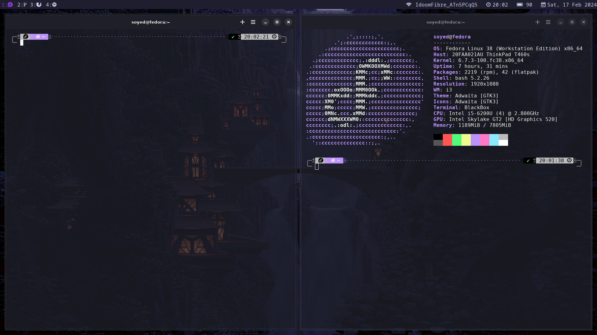

# Zoidi-i3-config

This repository contains the configuration file for the i3 window manager (`~/.config/i3/config`) along with additional setup instructions.

## General Configuration

- **$mod Key**: Mod4 (Windows key)
- **Font**: Monospace 12
- **Autostart Programs**:
  - Set wallpaper with `feh`
  - Lock screen with `xss-lock` and `i3lock`
  - Network Manager applet (`nm-applet`)
  - Compositor (`picom`)
  
## Keybindings

- **Volume Controls**: 
  - Increase Volume: XF86AudioRaiseVolume
  - Decrease Volume: XF86AudioLowerVolume
  - Mute: XF86AudioMute
  - Mic Mute: XF86AudioMicMute
- **Window Movement and Management**:
  - Open terminal: $mod+Return
  - Close window: $mod+Shift+q
- **Rofi Commands**:
  - Wi-Fi selection: $mod+Shift+w
  - Power management: $mod+Shift+p
- **Window Movement**:
  - Move focus left, down, up, right: $mod+j, $mod+k, $mod+l, $mod+semicolon
  - Move window left, down, up, right: $mod+Shift+j, $mod+Shift+k, $mod+Shift+l, $mod+Shift+semicolon
- **Workspaces**:
  - Switch to workspace: $mod+1 to $mod+6
  - Move window to workspace: $mod+Shift+1 to $mod+Shift+6

## Additional Configuration

- **Applications**:
  - Set specific workspaces for certain applications (e.g., code editor, web browser, Spotify)
- **Restart and Exit**:
  - Reload configuration: $mod+Shift+c
  - Restart i3: $mod+Shift+r
  - Exit i3: Hold $mod+e

## Layout and Appearance

- **Splitting and Layout**:
  - Split horizontally: $mod+h
  - Split vertically: $mod+v
  - Toggle fullscreen: $mod+f
  - Stack layout: $mod+s
  - Tabbed layout: $mod+w
  - Toggle split layout: $mod+e
  - Toggle floating: $mod+Shift+space
- **Outer and Inner Gaps**: Set gaps between windows and the screen edges

## Screenshots

- **Fullscreen Screenshot**: Press Print key
- **Selected Area Screenshot**: $mod+Shift+s

## Customization

- **Resize Mode**: Press $mod+r to enter resize mode, then use arrow keys to resize windows

## Colors and Appearance

- Customized colors for active, inactive, focused, and urgent workspaces
- Custom border styles for Firefox windows

## Acknowledgments

- This configuration is optimized for personal use but can be customized further based on individual preferences and workflow.

